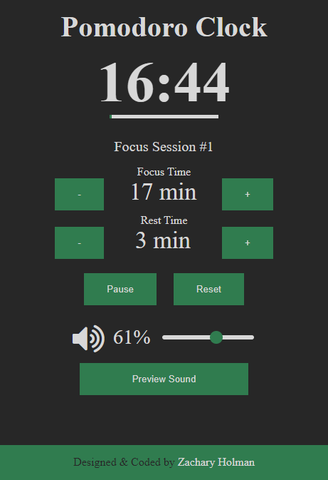

# Pomodoro Clock
A pomodoro clock. Created while going through the advanced front end development projects at www.freeCodeCamp.org

## [Front End Development Projects](https://github.com/Squibs/freeCodeCamp#freecodecamp) (Go Back to My freeCodeCamp Repository)

### [Pomodoro Clock](https://squibs.github.io/pomodoro-clock/) (Click to view functional site)

<em>Completed August 3, 2017</em>

A [pomodoro clock](https://en.wikipedia.org/wiki/Pomodoro_Technique) I created while going through the advanced front end development projects on freeCodeCamp. This project had the requirements of being able to start a 25 minute pomodoro timer that would go off after 25 minutes had elapsed, the ability to reset the timer, and the ability to customize the length of the pomodoro timer.

I decided to use [JavaScript classes](https://developer.mozilla.org/en-US/docs/Web/JavaScript/Reference/Classes) for this project. At first I was struggling to figure out exactly how to accomplish this. However after many tutorials and a lot of struggling, I came up with what this project is now. I have a Pomodoro class that has several methods to accomplish everything for this project. I'm still not quite sure I used the class identifier / object-oriented programming in a correct manner.

I included the ability to adjust the focus and rest time lengths; as well as the ability to start, pause, resume and reset the timer as it counts down. I decided to also include a volume slider to control the the volume of the alarms / alerts that go off once the timer reaches the end of the focus or rest periods respectively.

        
